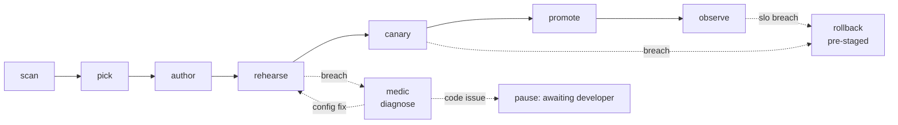
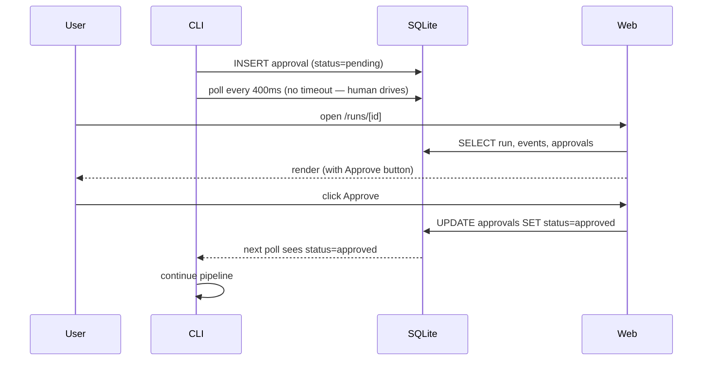
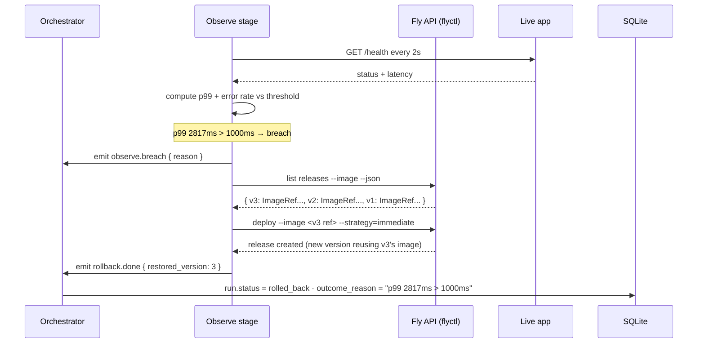
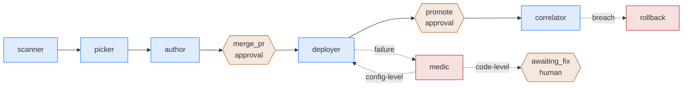

# Architecture

## System at a glance

```mermaid
flowchart TB
  subgraph Operator[Operator surfaces]
    CLI["Convoy CLI<br/>commander + tsx"]
    Web["Web viewer<br/>Next.js 15 + Tailwind"]
    Plugin["Claude Code plugin<br/>slash commands + subagents"]
  end

  subgraph Core[Convoy core]
    Scanner["scanner<br/>ecosystem · deps · topology"]
    Picker["picker<br/>existing config · override · scored"]
    Author["author<br/>drafts only Convoy-owned files"]
    Enricher["enricher (Opus 4.7)<br/>summary · reason · narrative · Dockerfile"]
    Orch["orchestrator<br/>stage runner · approvals · abort"]
    Medic["medic (Opus 4.7)<br/>log diagnosis · classification"]
    Bus["event bus<br/>run · event · approval"]
  end

  subgraph Persistence[Persistence]
    SQLite["SQLite<br/>runs · run_events · approvals"]
    Plans["plans/*.json<br/>inspectable artifacts"]
  end

  subgraph Targets[Deployment targets]
    Fly["fly (real)<br/>flyctl deploy · alias rollback"]
    Vercel["vercel (real)<br/>preview → prod · alias rollback"]
    Railway["railway<br/>(stubbed, v2)"]
    CloudRun["cloudrun<br/>(stubbed, v2)"]
  end

  CLI --> Orch
  Web --> SQLite
  Plugin --> Orch

  Orch --> Scanner
  Scanner --> Picker
  Picker --> Author
  Author --> Enricher
  Enricher --> Plans

  Orch --> Bus
  Bus --> SQLite

  Orch -- "on failure" --> Medic
  Medic --> Bus

  Orch -. "deploy · ephemeral · logs · rollback" .-> Fly
  Orch -. .-> Railway
  Orch -. .-> Vercel
  Orch -. .-> CloudRun

  SQLite --> CLI
  SQLite --> Web
```

## Pipeline

A Convoy run is a sequence of stages. Each stage produces evidence; the next stage runs only if the evidence passes policy.



| Stage | Responsibility | Gate |
|---|---|---|
| **scan** | Detect framework, runtime, topology, dependencies, deployment signals. | Signals complete |
| **pick** | Score available platforms against signals; respect user override or existing platform config. | One platform chosen with stated reasoning |
| **author** | Draft missing deployment config (Dockerfile, platform manifest, CI) into a pull request. Never touches developer code. | Pull request opened and human-approved |
| **rehearse** | Deploy to an ephemeral twin on the chosen platform. Run health checks, smoke tests, migration dry-run, synthetic load. | All checks green |
| **canary** | Promote to a fraction of production traffic. Correlator watches golden signals versus baseline for the bake window. | Signals within policy |
| **promote** | Progressive rollout to full production. | No regression detected at each step |
| **observe** | Post-deploy watch window. Continues to monitor; can trigger rollback. | SLO-healthy for the configured window |

The **medic** activates on any stage failure. It is a **Claude agent loop** (Opus 4.7) with four scoped tools: `read_log_tail`, `read_file`, `grep_repo`, and `finalize_diagnosis`. The agent picks which tools to call in what order, up to six turns. Path-traversal is refused at the tool boundary — the agent cannot read outside `repoPath`. When the root cause is in a Convoy-authored file (Dockerfile, platform manifest, `.env.schema`) the medic emits `owned=convoy` with a proposed patch. When the root cause is in developer code the medic emits `owned=developer` with a plain-language fix and the pipeline pauses for the human to push — it will not retry against code Convoy doesn't own.

The **rollback** path is pre-staged at every stage. Forward progress is never permitted without a named, measured reverse.

## Subagents

| Agent | Role |
|---|---|
| **scanner** | Parses repo into signals. Platform-neutral. |
| **picker** | Scores platforms. Respects explicit user choice and existing platform config. |
| **author** | Drafts deployment surface files in a pull request. Only owns files it creates. |
| **deployer** | Delegates to the chosen platform adapter. |
| **medic** | Claude agent loop. Four scoped tools; up to six turns. Emits structured diagnosis; pauses for developer fix on `owned=developer`. Implementation: `src/core/medic.ts`. |
| **correlator** | Reads metrics during canary and observe stages. Decides go/no-go between promotion steps. |
| **policy** | Evaluates rules — freeze windows, tier, required approvers, blast-radius budget. |

## Adapter model

Platform-specific concerns live behind a single interface. `agent-core` is platform-neutral.

```
agent-core
    │
    ├─ adapters/
    │   ├─ fly        — wraps flyctl
    │   ├─ railway    — wraps railway CLI and API
    │   ├─ vercel     — wraps vercel CLI
    │   └─ cloudrun   — wraps gcloud run
    │
    └─ mcp servers one-per-adapter, plus github + metrics
```

Each adapter implements:

- `deploy(config)` — produce a live deployment.
- `createEphemeral(config) → id` — spin up a throwaway twin for rehearsal.
- `destroyEphemeral(id)` — tear down the twin.
- `rollback(targetRelease)` — revert to a previous release.
- `readLogs(deploymentId, since) → stream` — structured log stream for medic.
- `healthCheck(deploymentId) → result` — synchronous readiness probe.

## Provenance

Convoy tracks which files it authored in `.convoy/manifest.yaml`. A file is one of:

- **convoy-authored** — drafted by Convoy, may be iterated on autonomously.
- **developer-authored** — pre-existing or subsequently edited by a human. Read-only to Convoy.

If a developer edits a Convoy-authored file, its provenance flips permanently. Convoy never claims a file back.

## State

Run state — events, approvals, artifacts, decisions — is persisted in a single SQLite database at `.convoy/state.db` for local runs, or a shared database for team deployments. The schema models `Run`, `RunEvent`, `Approval`, `Artifact`, `Decision`.

## Interfaces

- **CLI** — primary operator surface. `convoy plan`, `convoy apply`, `convoy plans`, `convoy status`.
- **Web viewer** — plan detail with drafted-file previews, runs list, live run timeline with polling refresh, approval buttons via server actions, medic diagnosis cards.
- **Claude Code plugin** — `/convoy ship`, `/convoy-status`, `/convoy-rollback` slash commands; six subagents (scanner, picker, author, deployer, medic, correlator) defined as markdown files with tool scopes.
- **MCP servers** — platform adapters (github, fly, railway, vercel, cloudrun) — declared in the plugin manifest; implementation tracked in Day 4+ work.
- **Audit log** — `run_events` table. Every state change, every Opus reasoning artifact, every approval decision is recorded with a timestamp and is replayable for incident review.

## Approval loop



## Rollback — the real reverse path

Rollback is pre-staged at every production stage. On observe-stage breach the platform adapter fires the measured reverse without a human click.



Same shape for Vercel: `vercel ls --json` → pick a prior `READY` production deployment → `vercel alias set <prior-url> <prod-alias>`. Proven end-to-end in [`rollback-proof.md`](./rollback-proof.md).

## Agent handoffs



Agents hand work to each other through the orchestrator and the SQLite event bus. Medic and rollback are only invoked when real signals fire — no scripted branching.
